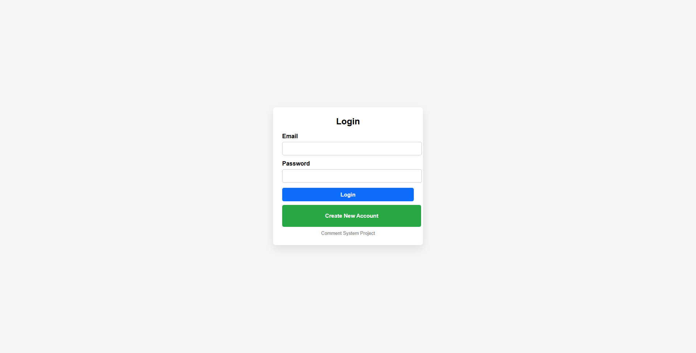
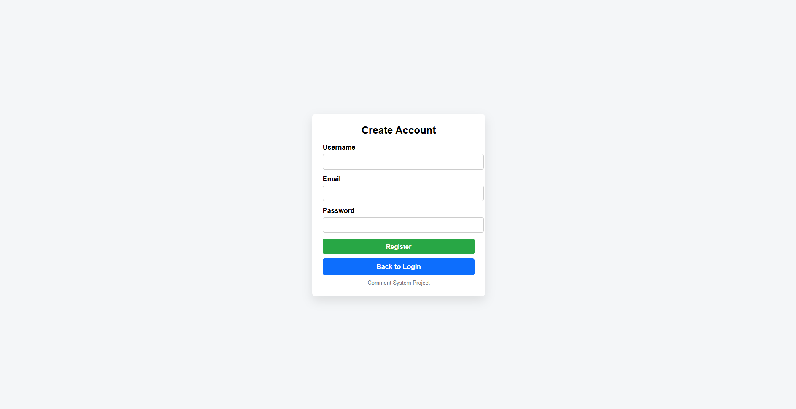
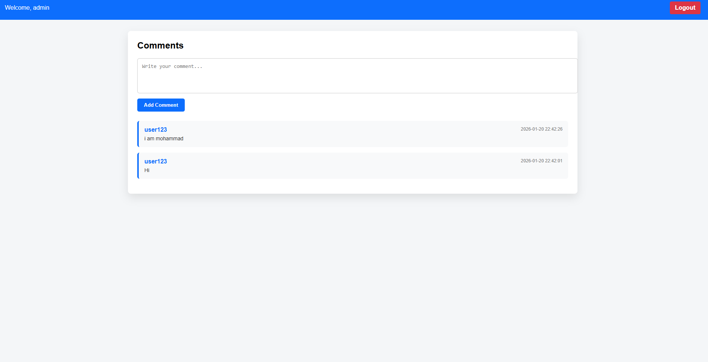

# 💬 Simple Comments System

A simple web-based comment system developed using PHP and MySQL. Users can register, log in, and post comments that are displayed instantly in a shared comment section.

---

## 🚀 Features

- User Registration
- User Login & Logout
- Session Authentication
- Add New Comments
- Display All Comments
- Store Data in MySQL
- Responsive User Interface

---

## 🛠️ Technologies Used

- PHP
- MySQL
- HTML5
- CSS3

---

## 📁 Project Structure

```
simple-comments-system/
│
├── screenshots/
│   ├── login.png
│   ├── SignUo.png
│   └── comments.png
│
├── connection.php
├── register.php
├── login.php
├── logout.php
├── comments.php
├── comment_system.sql
└── README.md
```

---

## 📷 Screenshots

### 🔐 Login Page

Users can log in using their registered account.



---

### 👤 Registration Page

Create a new account before accessing the comment system.



---

### 💬 Comments Page

After logging in, users can write comments and view comments posted by everyone.



---

## ⚙️ Installation

1. Clone the repository

```bash
git clone https://github.com/your-username/simple-comments-system.git
```

2. Move the project into the **htdocs** folder.

3. Import the database:

```
comment_system.sql
```

4. Update the database connection inside:

```
connection.php
```

5. Start Apache and MySQL using XAMPP.

6. Open your browser:

```
http://localhost/simple-comments-system/
```

---

## 📌 Project Workflow

1. Register a new account.
2. Login using your account.
3. Access the comments page.
4. Write and submit comments.
5. View all comments shared by users.
6. Logout securely.

---

## 👨‍💻 Author

**Abdalwahab**
